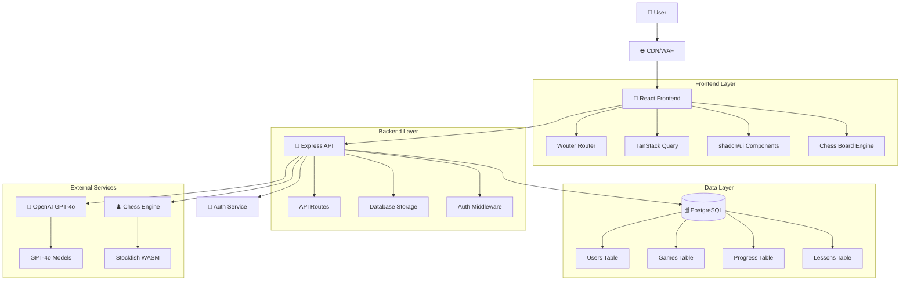
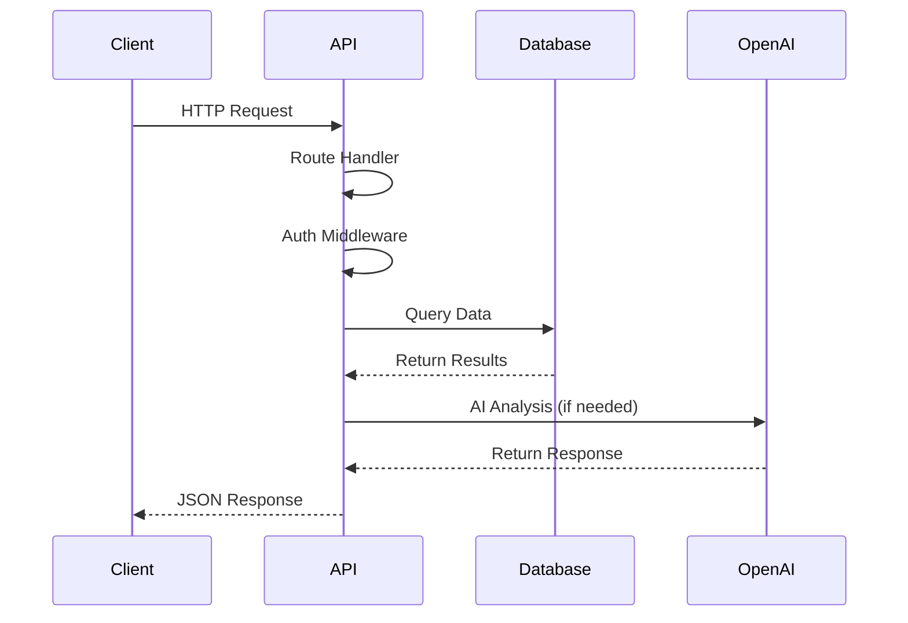
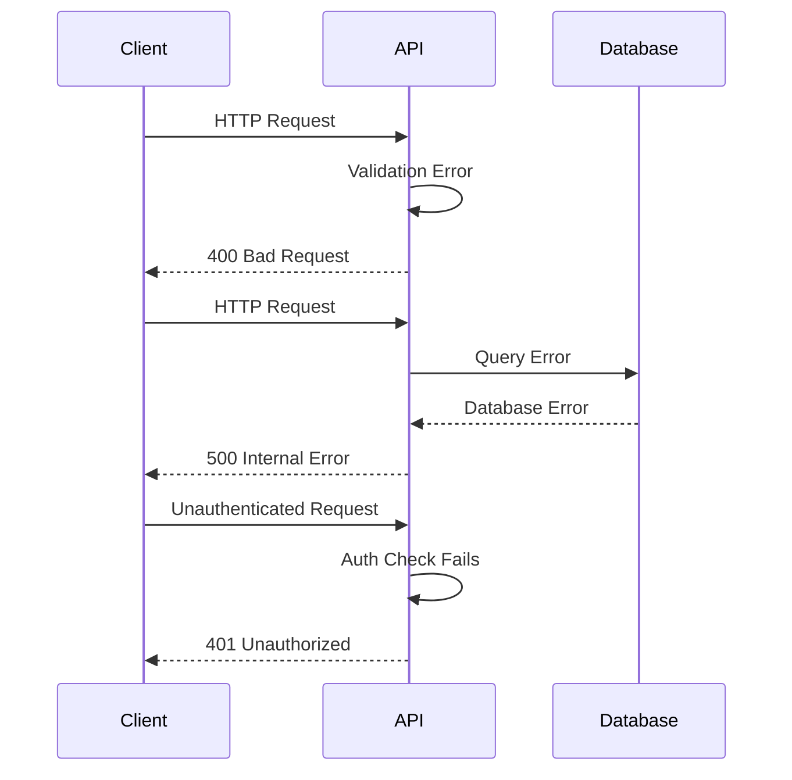

# Chess Learning App - System Architecture

## System Overview



## Runtime & Frameworks

### Frontend Stack
- **React 18** with TypeScript - Modern UI framework
- **Vite** - Fast development and build tooling
- **Wouter** - Lightweight client-side routing
- **TanStack React Query** - Server state management and caching
- **shadcn/ui + Radix UI** - Accessible component system
- **Tailwind CSS** - Utility-first styling
- **chess.js** - Chess game logic and validation

### Backend Stack
- **Node.js** with Express.js - RESTful API server
- **TypeScript** - Type-safe development
- **Drizzle ORM** - Type-safe database operations
- **PostgreSQL** - Relational database (Neon serverless)
- **Passport.js** - Authentication middleware
- **bcryptjs** - Password hashing

### AI & Analysis
- **OpenAI GPT-4o** - Primary chess AI engine
- **Stockfish WASM** - Move evaluation and analysis
- **Ollama** - Optional open-source AI models

## Module Boundaries & Responsibilities

### Client Layer (`/client`)
- **Pages** - Route-level components and views
- **Components** - Reusable UI components
- **Hooks** - Custom React hooks for state and logic
- **Engines** - Chess game engine and Stockfish integration
- **Lib** - Utilities and query client configuration

### Server Layer (`/server`) 
- **Routes** - API endpoint definitions and handlers
- **Storage** - Database abstraction layer (IStorage interface)
- **Auth** - Authentication and authorization logic
- **AI Services** - Chess AI engines and move evaluation
- **Database** - Drizzle ORM configuration and connections

### Shared Layer (`/shared`)
- **Schema** - Zod validation schemas and TypeScript types
- **Types** - Common interfaces shared between client/server

## Request Lifecycle

### Standard Request Flow


### Error Flow


## Configuration & Environments

### Environment Configuration
- **Development** - Local Replit environment
- **Staging** - Replit deployment with test data
- **Production** - Custom domain deployment

### Secrets Strategy
```typescript
// Required Environment Variables
DATABASE_URL=postgresql://...     // Neon PostgreSQL connection
OPENAI_API_KEY=sk-...            // OpenAI API access
PGHOST, PGPORT, PGUSER, etc.     // Database connection details
```

### Feature Flags
- `AI_ENGINE_SELECTION` - Choose between OpenAI/Ollama/Traditional
- `PROGRESS_TRACKING` - Enable/disable user progress analytics
- `HINT_SYSTEM` - Control AI-powered hint generation

## Deployment Model

### Development Environment
- **Replit Workspace** - Integrated development environment
- **Hot Module Replacement** - Instant code updates via Vite
- **Database** - Neon PostgreSQL serverless instance

### Staging Environment  
- **Replit Deployments** - Automatic builds from main branch
- **Domain** - `*.replit.app` subdomain
- **Database** - Shared Neon instance with test data

### Production Deployment
- **Platform** - Replit Deployments with custom domain
- **Domain** - Custom domain with TLS/SSL
- **Database** - Dedicated Neon production instance
- **CDN** - Built-in CDN for static assets

## Observability

### Logging Strategy
- **Express Morgan** - HTTP request logging
- **Console Logging** - Development debugging
- **Structured Logs** - JSON format for production

### Metrics & Monitoring
- **Game Completion Rates** - Track user engagement
- **AI Response Times** - Monitor external API latency  
- **Database Query Performance** - Identify slow queries
- **Error Rates** - Track application stability

### Service Level Objectives (SLOs)
- **API Availability** - 99.5% uptime
- **Response Time** - P95 < 500ms for chess moves
- **AI Response Time** - P95 < 3000ms for move analysis
- **Database Query Time** - P95 < 100ms

### Health Checks
- **Database Connectivity** - Connection pool status
- **External API Status** - OpenAI API availability
- **Memory Usage** - Node.js heap monitoring

## Security Posture

### Authentication & Authorization
- **Session-based Auth** - Passport.js with secure sessions
- **Password Security** - bcrypt hashing with salt rounds
- **CSRF Protection** - Built-in Express security middleware
- **Rate Limiting** - API endpoint rate limiting

### Data Protection
- **Environment Variables** - Secrets stored securely in Replit
- **Database Security** - Connection encryption and access controls
- **Input Validation** - Zod schema validation on all endpoints
- **SQL Injection Prevention** - Drizzle ORM parameterized queries

### External Service Security  
- **API Key Rotation** - Regular OpenAI API key updates
- **Request Validation** - Strict input/output validation
- **Error Handling** - No sensitive data in error responses

> **Note:** For detailed security policies and procedures, see [SECURITY.md](./SECURITY.md)

## Data Flows & Privacy

### User Data Collection
- **Game Statistics** - ELO rating, games won/lost, move history
- **Learning Progress** - Lesson completion, skill assessments
- **Puzzle Performance** - Solution accuracy and timing
- **User Preferences** - UI settings, difficulty levels

### Data Processing
- **Real-time Analysis** - Move evaluation and hint generation
- **Progress Tracking** - Skill development over time
- **Personalized Recommendations** - AI-generated learning paths

### Data Retention
- **User Accounts** - Retained until account deletion
- **Game History** - 2 years for analysis and improvement
- **Session Data** - 30 days for debugging and analytics
- **AI Interactions** - Not stored beyond request processing

### Privacy Compliance
- **Data Minimization** - Only collect necessary information
- **User Consent** - Clear consent for data collection
- **Data Portability** - Export functionality for user data
- **Deletion Rights** - Complete account and data deletion

> **Note:** For comprehensive data handling policies, see [DATA.md](./DATA.md)

## Architecture Decision Records

### ADR-001: Database Choice - PostgreSQL
**Decision:** Use PostgreSQL with Drizzle ORM
**Rationale:** Relational data model, strong consistency, excellent tooling
**Status:** Implemented

### ADR-002: AI Engine Strategy
**Decision:** Multi-engine approach (OpenAI → Ollama → Traditional)
**Rationale:** Flexibility, cost optimization, fallback reliability
**Status:** Implemented

### ADR-003: Frontend Framework
**Decision:** React with Vite instead of Next.js
**Rationale:** Faster development, simpler deployment, better Replit integration
**Status:** Implemented

### ADR-004: State Management
**Decision:** TanStack Query for server state, local state for UI
**Rationale:** Optimal caching, automatic background updates, reduced boilerplate
**Status:** Implemented

---

*Last updated: August 12, 2025*