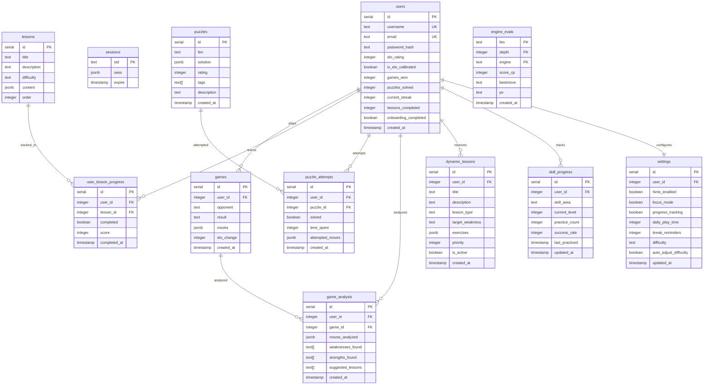

# Chess Learning App - Data Architecture

## Entity Relationship Diagram



## Table Specifications

### users
**Purpose**: Core user account data and chess statistics

| Column | Type | Constraints | Index | Nullability | Retention |
|--------|------|-------------|-------|-------------|-----------|
| id | serial | PRIMARY KEY | B-tree (unique) | NOT NULL | Permanent |
| username | text | UNIQUE, NOT NULL | B-tree (unique) | NOT NULL | Permanent |
| email | text | UNIQUE, NOT NULL | B-tree (unique) | NOT NULL | Permanent |
| password_hash | text | NOT NULL | None | NOT NULL | Permanent |
| elo_rating | integer | DEFAULT 1200 | B-tree | NOT NULL | Permanent |
| is_elo_calibrated | boolean | DEFAULT false | None | NOT NULL | Permanent |
| games_won | integer | DEFAULT 0 | None | NOT NULL | Permanent |
| puzzles_solved | integer | DEFAULT 0 | None | NOT NULL | Permanent |
| current_streak | integer | DEFAULT 0 | None | NOT NULL | Permanent |
| lessons_completed | integer | DEFAULT 0 | None | NOT NULL | Permanent |
| onboarding_completed | boolean | DEFAULT false | B-tree | NOT NULL | Permanent |
| created_at | timestamp | DEFAULT NOW() | B-tree | NOT NULL | Permanent |

**PII Classification**: HIGH (email, username)  
**Encryption**: Password hash (bcrypt), email encrypted at rest  
**Indexes**: 
- Primary: `users_pkey` (id)
- Unique: `users_username_key`, `users_email_key`
- Performance: `idx_users_elo_rating`, `idx_users_created_at`

### sessions  
**Purpose**: HTTP session storage for authentication

| Column | Type | Constraints | Index | Nullability | Retention |
|--------|------|-------------|-------|-------------|-----------|
| sid | text | PRIMARY KEY | B-tree (unique) | NOT NULL | 7 days |
| sess | jsonb | NOT NULL | GIN | NOT NULL | 7 days |
| expire | timestamp | NOT NULL | B-tree | NOT NULL | Auto-cleanup |

**PII Classification**: LOW (session data may contain user ID)  
**Encryption**: Session data encrypted in transit (HTTPS)  
**Indexes**: 
- Primary: `sessions_pkey` (sid)
- Cleanup: `idx_sessions_expire` for automated deletion

### games
**Purpose**: Chess game records and move history

| Column | Type | Constraints | Index | Nullability | Retention |
|--------|------|-------------|-------|-------------|-----------|
| id | serial | PRIMARY KEY | B-tree (unique) | NOT NULL | 2 years |
| user_id | integer | FOREIGN KEY → users.id | B-tree | NULLABLE | 2 years |
| opponent | text | None | None | NULLABLE | 2 years |
| result | text | NOT NULL | B-tree | NOT NULL | 2 years |
| moves | jsonb | NOT NULL | GIN | NOT NULL | 2 years |
| elo_change | integer | DEFAULT 0 | None | NOT NULL | 2 years |
| created_at | timestamp | DEFAULT NOW() | B-tree | NOT NULL | 2 years |

**PII Classification**: NONE  
**Encryption**: Standard encryption at rest  
**Indexes**:
- Primary: `games_pkey` (id)
- Foreign: `idx_games_user_id`  
- Analytics: `idx_games_created_at`, `idx_games_result`

### lessons
**Purpose**: Static chess lesson content

| Column | Type | Constraints | Index | Nullability | Retention |
|--------|------|-------------|-------|-------------|-----------|
| id | serial | PRIMARY KEY | B-tree (unique) | NOT NULL | Permanent |
| title | text | NOT NULL | B-tree | NOT NULL | Permanent |
| description | text | NOT NULL | None | NOT NULL | Permanent |
| difficulty | text | NOT NULL | B-tree | NOT NULL | Permanent |
| content | jsonb | NOT NULL | GIN | NOT NULL | Permanent |
| order | integer | NOT NULL | B-tree | NOT NULL | Permanent |

**PII Classification**: NONE  
**Encryption**: Standard encryption at rest  
**Indexes**:
- Primary: `lessons_pkey` (id)
- Query: `idx_lessons_difficulty`, `idx_lessons_order`

### user_lesson_progress
**Purpose**: Tracking individual lesson completion

| Column | Type | Constraints | Index | Nullability | Retention |
|--------|------|-------------|-------|-------------|-----------|
| id | serial | PRIMARY KEY | B-tree (unique) | NOT NULL | Permanent |
| user_id | integer | FOREIGN KEY → users.id | B-tree | NULLABLE | Permanent |
| lesson_id | integer | FOREIGN KEY → lessons.id | B-tree | NULLABLE | Permanent |
| completed | boolean | DEFAULT false | B-tree | NOT NULL | Permanent |
| score | integer | Range 0-100 | None | NULLABLE | Permanent |
| completed_at | timestamp | None | B-tree | NULLABLE | Permanent |

**PII Classification**: LOW (linked to user)  
**Encryption**: Standard encryption at rest  
**Indexes**:
- Primary: `user_lesson_progress_pkey` (id)
- Foreign: `idx_ulp_user_id`, `idx_ulp_lesson_id`
- Composite: `idx_ulp_user_lesson` (user_id, lesson_id)

### puzzles
**Purpose**: Chess puzzle repository for assessment

| Column | Type | Constraints | Index | Nullability | Retention |
|--------|------|-------------|-------|-------------|-----------|
| id | serial | PRIMARY KEY | B-tree (unique) | NOT NULL | Permanent |
| fen | text | NOT NULL | B-tree | NOT NULL | Permanent |
| solution | jsonb | NOT NULL | GIN | NOT NULL | Permanent |
| rating | integer | NOT NULL | B-tree | NOT NULL | Permanent |
| tags | text[] | None | GIN | NULLABLE | Permanent |
| description | text | None | None | NULLABLE | Permanent |
| created_at | timestamp | DEFAULT NOW() | B-tree | NOT NULL | Permanent |

**PII Classification**: NONE  
**Encryption**: Standard encryption at rest  
**Indexes**:
- Primary: `puzzles_pkey` (id)
- Query: `idx_puzzles_rating`, `idx_puzzles_tags`

### puzzle_attempts
**Purpose**: User puzzle solving attempts for ELO calculation

| Column | Type | Constraints | Index | Nullability | Retention |
|--------|------|-------------|-------|-------------|-----------|
| id | serial | PRIMARY KEY | B-tree (unique) | NOT NULL | 1 year |
| user_id | integer | FOREIGN KEY → users.id | B-tree | NULLABLE | 1 year |
| puzzle_id | integer | FOREIGN KEY → puzzles.id | B-tree | NULLABLE | 1 year |
| solved | boolean | NOT NULL | B-tree | NOT NULL | 1 year |
| time_spent | integer | Seconds | None | NULLABLE | 1 year |
| attempted_moves | jsonb | None | GIN | NULLABLE | 1 year |
| created_at | timestamp | DEFAULT NOW() | B-tree | NOT NULL | 1 year |

**PII Classification**: LOW (linked to user)  
**Encryption**: Standard encryption at rest  
**Indexes**:
- Primary: `puzzle_attempts_pkey` (id)
- Foreign: `idx_pa_user_id`, `idx_pa_puzzle_id`
- Analytics: `idx_pa_solved`, `idx_pa_created_at`

### engine_evals
**Purpose**: Cached chess engine evaluations

| Column | Type | Constraints | Index | Nullability | Retention |
|--------|------|-------------|-------|-------------|-----------|
| fen | text | PRIMARY KEY (composite) | B-tree | NOT NULL | 30 days |
| depth | integer | PRIMARY KEY (composite) | B-tree | NOT NULL | 30 days |
| engine | text | PRIMARY KEY (composite) | B-tree | NOT NULL | 30 days |
| score_cp | integer | Centipawns | None | NULLABLE | 30 days |
| bestmove | text | UCI format | None | NULLABLE | 30 days |
| pv | text | Principal variation | None | NULLABLE | 30 days |
| created_at | timestamp | DEFAULT NOW() | B-tree | NOT NULL | 30 days |

**PII Classification**: NONE  
**Encryption**: Standard encryption at rest  
**Indexes**:
- Primary: `engine_evals_pkey` (fen, depth, engine)
- Cleanup: `idx_ee_created_at` for automated purging

### game_analysis
**Purpose**: AI-generated game analysis and learning insights

| Column | Type | Constraints | Index | Nullability | Retention |
|--------|------|-------------|-------|-------------|-----------|
| id | serial | PRIMARY KEY | B-tree (unique) | NOT NULL | 1 year |
| user_id | integer | FOREIGN KEY → users.id | B-tree | NULLABLE | 1 year |
| game_id | integer | FOREIGN KEY → games.id | B-tree | NULLABLE | 1 year |
| moves_analyzed | jsonb | NOT NULL | GIN | NOT NULL | 1 year |
| weaknesses_found | text[] | None | GIN | NULLABLE | 1 year |
| strengths_found | text[] | None | GIN | NULLABLE | 1 year |
| suggested_lessons | text[] | None | GIN | NULLABLE | 1 year |
| created_at | timestamp | DEFAULT NOW() | B-tree | NOT NULL | 1 year |

**PII Classification**: LOW (linked to user gameplay)  
**Encryption**: Standard encryption at rest  
**Indexes**:
- Primary: `game_analysis_pkey` (id)
- Foreign: `idx_ga_user_id`, `idx_ga_game_id`
- Search: `idx_ga_weaknesses`, `idx_ga_strengths`

### dynamic_lessons
**Purpose**: Personalized AI-generated lessons

| Column | Type | Constraints | Index | Nullability | Retention |
|--------|------|-------------|-------|-------------|-----------|
| id | serial | PRIMARY KEY | B-tree (unique) | NOT NULL | 6 months |
| user_id | integer | FOREIGN KEY → users.id | B-tree | NULLABLE | 6 months |
| title | text | NOT NULL | B-tree | NOT NULL | 6 months |
| description | text | NOT NULL | None | NOT NULL | 6 months |
| lesson_type | text | NOT NULL | B-tree | NOT NULL | 6 months |
| target_weakness | text | NOT NULL | B-tree | NOT NULL | 6 months |
| exercises | jsonb | NOT NULL | GIN | NOT NULL | 6 months |
| priority | integer | DEFAULT 1, Range 1-10 | B-tree | NOT NULL | 6 months |
| is_active | boolean | DEFAULT true | B-tree | NOT NULL | 6 months |
| created_at | timestamp | DEFAULT NOW() | B-tree | NOT NULL | 6 months |

**PII Classification**: LOW (personalized content)  
**Encryption**: Standard encryption at rest  
**Indexes**:
- Primary: `dynamic_lessons_pkey` (id)
- Foreign: `idx_dl_user_id`
- Query: `idx_dl_priority`, `idx_dl_active`, `idx_dl_type`

### skill_progress
**Purpose**: Granular skill tracking across chess domains

| Column | Type | Constraints | Index | Nullability | Retention |
|--------|------|-------------|-------|-------------|-----------|
| id | serial | PRIMARY KEY | B-tree (unique) | NOT NULL | Permanent |
| user_id | integer | FOREIGN KEY → users.id | B-tree | NULLABLE | Permanent |
| skill_area | text | NOT NULL | B-tree | NOT NULL | Permanent |
| current_level | integer | DEFAULT 1, Range 1-10 | None | NOT NULL | Permanent |
| practice_count | integer | DEFAULT 0 | None | NOT NULL | Permanent |
| success_rate | integer | DEFAULT 0, Range 0-100 | None | NOT NULL | Permanent |
| last_practiced | timestamp | None | B-tree | NULLABLE | Permanent |
| updated_at | timestamp | DEFAULT NOW() | B-tree | NOT NULL | Permanent |

**PII Classification**: LOW (linked to user progress)  
**Encryption**: Standard encryption at rest  
**Indexes**:
- Primary: `skill_progress_pkey` (id)
- Foreign: `idx_sp_user_id`
- Composite: `idx_sp_user_skill` (user_id, skill_area)

### settings
**Purpose**: User preferences and configuration

| Column | Type | Constraints | Index | Nullability | Retention |
|--------|------|-------------|-------|-------------|-----------|
| id | serial | PRIMARY KEY | B-tree (unique) | NOT NULL | Permanent |
| user_id | integer | FOREIGN KEY → users.id | B-tree | NULLABLE | Permanent |
| hints_enabled | boolean | DEFAULT true | None | NOT NULL | Permanent |
| focus_mode | boolean | DEFAULT false | None | NOT NULL | Permanent |
| progress_tracking | boolean | DEFAULT true | None | NOT NULL | Permanent |
| daily_play_time | integer | DEFAULT 30, Range 5-180 | None | NOT NULL | Permanent |
| break_reminders | integer | DEFAULT 15, Range 5-60 | None | NOT NULL | Permanent |
| difficulty | text | DEFAULT 'beginner' | B-tree | NOT NULL | Permanent |
| auto_adjust_difficulty | boolean | DEFAULT true | None | NOT NULL | Permanent |
| updated_at | timestamp | DEFAULT NOW() | B-tree | NOT NULL | Permanent |

**PII Classification**: LOW (user preferences)  
**Encryption**: Standard encryption at rest  
**Indexes**:
- Primary: `settings_pkey` (id)
- Foreign: `idx_settings_user_id` (unique)

## Data Security & Privacy

### PII Classification System

**HIGH PII**: Direct identifiers
- `users.email` - Personal email addresses
- `users.username` - Chosen identifiers

**LOW PII**: Indirect identifiers  
- All user-linked behavioral data
- Game preferences and settings
- Learning progress and analytics

**NONE**: Anonymous data
- Static lesson content
- Chess position evaluations
- Puzzle definitions

### Encryption Strategy

**At Rest**:
- Database-level encryption (AES-256) via Neon PostgreSQL
- Application-level password hashing (bcrypt, 12 rounds)
- Email addresses encrypted with deterministic encryption for uniqueness

**In Transit**:
- TLS 1.3 for all database connections
- HTTPS only for API endpoints
- Session cookies with `Secure` and `HttpOnly` flags

### Data Masking for Logs

**Production Logging Rules**:
```typescript
// Email masking: user@domain.com → u***@d***.com
// Username masking: chessmaster → c***r
// IP addresses: 192.168.1.100 → 192.168.1.***
// User IDs: Preserved for correlation (not PII)
```

**Development Environment**:
- Full data visibility for debugging
- Synthetic test data for external demos
- No production data in development databases

For comprehensive security policies, see [SECURITY.md](./SECURITY.md).

## Migration & Schema Evolution

### Forward-Only Migration Policy

**Principles**:
1. **Additive Changes**: New columns, indexes, tables only
2. **Backward Compatibility**: Old application versions continue working
3. **Deprecation Cycle**: Mark → Warn → Remove (minimum 30 days)
4. **Zero Downtime**: All migrations run online without service interruption

**Migration Types**:

```sql
-- ✅ SAFE: Adding nullable column
ALTER TABLE users ADD COLUMN preferences JSONB DEFAULT '{}';

-- ✅ SAFE: Adding index concurrently  
CREATE INDEX CONCURRENTLY idx_games_user_created 
ON games (user_id, created_at);

-- ⚠️  CAREFUL: Adding NOT NULL column
ALTER TABLE users ADD COLUMN timezone TEXT DEFAULT 'UTC';
-- Later: ALTER TABLE users ALTER COLUMN timezone SET NOT NULL;

-- ❌ DANGEROUS: Dropping columns (use deprecation cycle)
-- Step 1: Application ignores column
-- Step 2: Mark column deprecated (comment)
-- Step 3: After 30 days, DROP COLUMN
```

**Zero-Downtime Steps**:
1. **Deploy Migration**: Schema changes without app dependencies
2. **Deploy Application**: New code handles both old/new schema
3. **Verify Compatibility**: Monitor for errors and rollback readiness
4. **Remove Compatibility**: Clean up deprecated code paths

### Rollback Strategy

**Schema Rollbacks**:
- Migrations are numbered and tracked in `schema_migrations` table
- Rollback scripts prepared for each forward migration
- Database snapshots before major migrations
- Feature flags to disable new functionality

**Application Rollbacks**:
- Blue-green deployments for instant rollback
- Database schema backwards compatible for ≥2 versions
- Gradual rollout with automatic monitoring

## Backup & Disaster Recovery

### Backup Policy

**Frequency**:
- **Continuous**: WAL-E streaming to encrypted S3 bucket
- **Point-in-Time**: Recovery available for last 7 days
- **Daily Snapshots**: Full database backup retained 30 days
- **Weekly Archives**: Long-term storage retained 1 year

**Backup Contents**:
```yaml
Primary Database:
  - All user data and game history
  - Session data (excluded from long-term backups)
  - Engine evaluations (excluded from archives)
  
Configuration:
  - Database schema and migrations
  - Application configuration
  - Environment variables (secrets excluded)
  
External Dependencies:
  - OpenAI API usage logs
  - Replit deployment configurations
```

**Encryption**: All backups encrypted with AES-256, keys rotated quarterly

### Restore Procedures

**Recovery Time Objectives (RTO)**:
- Point-in-time restore: < 30 minutes
- Full database restore: < 2 hours
- Cross-region failover: < 1 hour

**Recovery Point Objectives (RPO)**:
- Maximum data loss: < 5 minutes (streaming backups)
- Transaction log backup frequency: 30 seconds

**Disaster Recovery Steps**:
1. **Assess Impact**: Determine scope of data loss
2. **Activate Standby**: Switch to backup database instance
3. **Restore Point**: Select appropriate recovery timestamp
4. **Validate Data**: Run integrity checks and sample queries
5. **Resume Operations**: Update DNS and application configuration
6. **Post-Incident**: Analyze cause and update procedures

### Backup Testing & Drills

**Monthly Drills**:
- Restore random backup to staging environment
- Verify data integrity with automated tests
- Measure restore time against RTO targets
- Test application functionality with restored data

**Quarterly Reviews**:
- Update disaster recovery documentation
- Review and test cross-region failover
- Validate encryption key rotation procedures
- Conduct full team DR simulation

**Monitoring**:
- Automated backup success/failure alerts
- Backup size and timing trend analysis
- Regular restoration testing in isolated environment
- Integration with application health monitoring

## Data Retention & Cleanup

### Automated Cleanup Policies

```sql
-- Daily cleanup jobs
DELETE FROM sessions WHERE expire < NOW();
DELETE FROM engine_evals WHERE created_at < NOW() - INTERVAL '30 days';

-- Weekly cleanup jobs  
DELETE FROM games WHERE created_at < NOW() - INTERVAL '2 years';
DELETE FROM puzzle_attempts WHERE created_at < NOW() - INTERVAL '1 year';
DELETE FROM dynamic_lessons WHERE created_at < NOW() - INTERVAL '6 months' 
    AND is_active = false;

-- Monthly archive jobs
-- Move old game_analysis to archive table
-- Compress inactive user data
```

### User Data Rights

**Data Export**: Complete user data export in JSON format
**Data Deletion**: Cascade delete with anonymization option  
**Data Portability**: Standard formats for chess data (PGN, FEN)
**Retention Override**: Users can request extended retention

---

*Database Version: 1.2 | Last Updated: August 12, 2025*
*Compatible with OpenAPI v1.0 schemas*